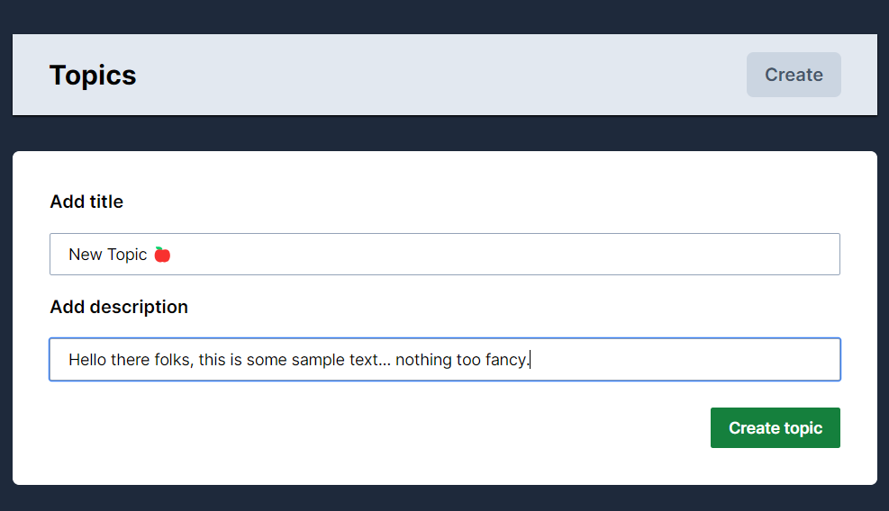
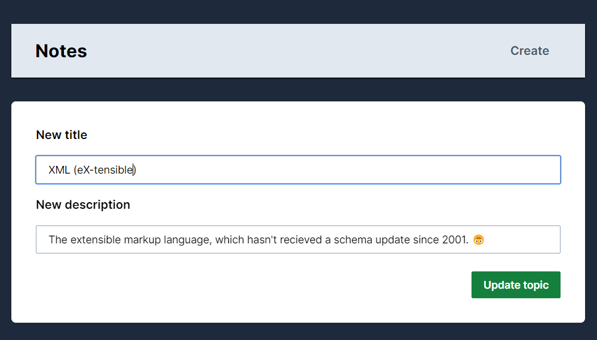

# CRUD Topics

This is a simple web application that lets the users **create**, **read**, **update** and **delete** topics. 📝

## Getting Started

First, run the development server:

```bash
npm run dev
# or
yarn dev
# or
pnpm dev
# or
bun dev
```

Open [http://localhost:3000](http://localhost:3000) with your browser to see the result.

You can start editing the page by modifying `app/page.tsx`.

This project uses [`next/font`](https://nextjs.org/docs/basic-features/font-optimization) to automatically optimize and load Inter, a custom Google Font.

## Preview

### Home page


### Creating a new topic


### Updating an existing topic


## Deployment link

> [Check it out!](https://nextjs-notes-app-kappa.vercel.app/)